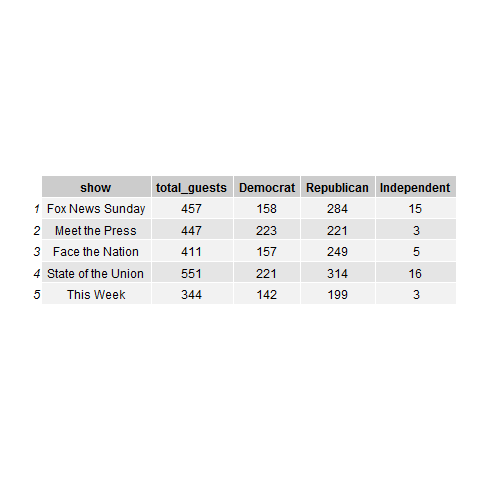
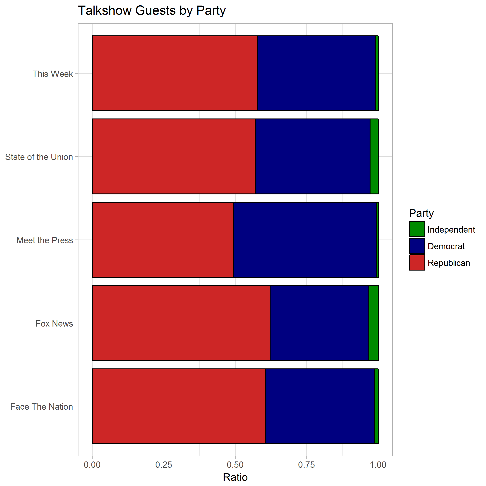

## Background 

In a New York Times [article](https://www.nytimes.com/2014/09/06/upshot/looking-for-john-mccain-try-a-sunday-morning-show.html) from December 2014, Derek Willis discusses the results of an analysis of more than 1,500 people who have appeard on five Sunday news and political talk shows: "Meet the Press," "Face the Nation," "This Week," "Fox News Sunday" and "State of the Union.". In his article, Willis focusses on the number of appearances of different personalities across the shows and highlights frequent guests. In the context of  "fake news" and biased media coverage, I asked myself another question: "Do all Sunday talk shows invite an even amount of representatives from the different politcal parties?". Considering that different tv-networks in America cater to different audiences (as described in this Washitngton Post [article](https://www.washingtonpost.com/news/the-fix/wp/2014/10/21/lets-rank-the-media-from-liberal-to-conservative-based-on-their-audiences/?utm_term=.c9a030a0aafbConsidering)) the likely answer is no. However, I decided to take a closer look and investigate which talkshows favor guests from which politcal parties. 

## Overview of TV Networks  

* Meet the Press [NBC](https://en.wikipedia.org/wiki/NBC)  

Considered liberal. 

* Face the Nation [CBS](https://en.wikipedia.org/wiki/CBS)  

Considered liberal.

* This Week [ABC](https://en.wikipedia.org/wiki/ABC_News) 

considered liberal. 

* State of the Union [CNN](https://en.wikipedia.org/wiki/CNN)  

considered liberal.

* Fox News Sunday [Fox News](https://en.wikipedia.org/wiki/Fox_News) 

Considered conservative. Created by Australian-American media mogul Rupert Murdoch, who hired former Republican Party media consultant and CNBC executive Roger Ailes as its founding CEO.

Further, this image from [Business Insider](http://www.businessinsider.com/what-your-preferred-news-outlet-says-about-your-political-ideology-2014-10) summarizes how liberal or conservative major American news sources are.

## Hypothesis & Approach

My hypothesis is simply that different talk shows favor guests from different parties. Since the underlying dataset of the New York Times article does not contain any information on the political affiliation of talk show guests, I used data on current and previous US legislators to add their party info to the data. Since I was not able to find any information on the political orientation of other guests, my further analysis disregards all talk show guests who are not current or previous legislators of the United States. Obviously, this limits the informative value of my analysis  - but I still have around 2,200 appearances of US politicians across the five talk shows. 

In the further process of the projcet, I summarized the data 

## Results

The following table summarizes the total counts of guests from the different parties for each talk show: 

The below graph visualizes the fact that most talk shows have a larger proportion of guests coming from the Republican Party. According to my analysis, only NBC's "Meet The Press" has offered an even amount of screen time to politicians from the Republican and Democratic Party.

## Interpretation 

In the final report, I will add some interpretation of the results as well as the limitations of my analysis to this section. 
