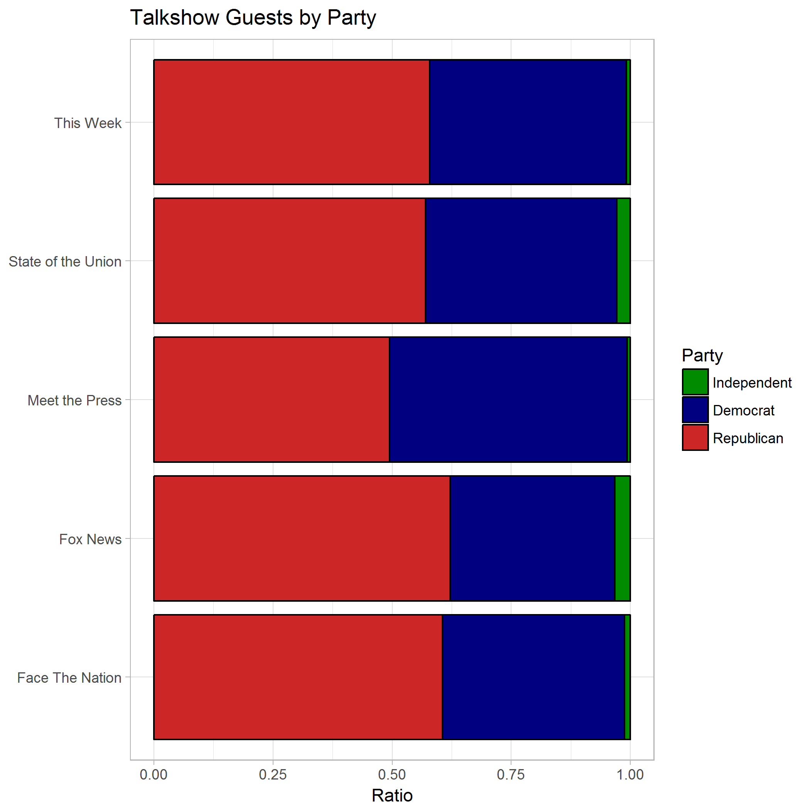

Talkshow Guest Analysis
================
Alexander Kleefeldt
December 9, 2017

Background
==========

In a New York Times [article](https://www.nytimes.com/2014/09/06/upshot/looking-for-john-mccain-try-a-sunday-morning-show.html) from December 2014, Derek Willis discusses the results of an analysis of more than 1,500 people who have appeard on five Sunday news and political talk shows: "Meet the Press," "Face the Nation," "This Week," "Fox News Sunday" and "State of the Union.". In his article, Willis focusses on the number of appearances of different personalities across the shows and highlights frequent guests. In the context of "fake news" and biased media coverage, I asked myself another question: "Do all Sunday talk shows invite an even amount of representatives from the different politcal parties?". Considering that different tv-networks in America cater to different audiences (as described in this Washitngton Post [article](https://www.washingtonpost.com/news/the-fix/wp/2014/10/21/lets-rank-the-media-from-liberal-to-conservative-based-on-their-audiences/?utm_term=.c9a030a0aafbConsidering)) the likely answer is no. However, I decided to take a closer look and investigate which talkshows favor guests from which politcal parties.

Hypothesis & Approach
=====================

My hypothesis is simply that different talk shows favor guests from different parties. Since the underlying dataset of the New York Times article does not contain any information on the political affiliation of talk show guests, I used data on current and previous US legislators to add their party info to the data. Since I was not able to find any information on the political orientation of other guests, my further analysis disregards all talk show guests who are not current or previous legislators of the United States. Obviously, this limits the informative value of my analysis - but I still have around 2,200 appearances of US politicians across the five talk shows.

Results
=======

